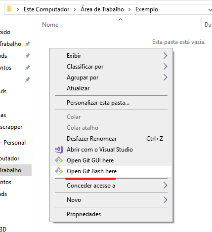
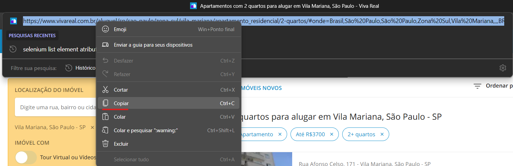
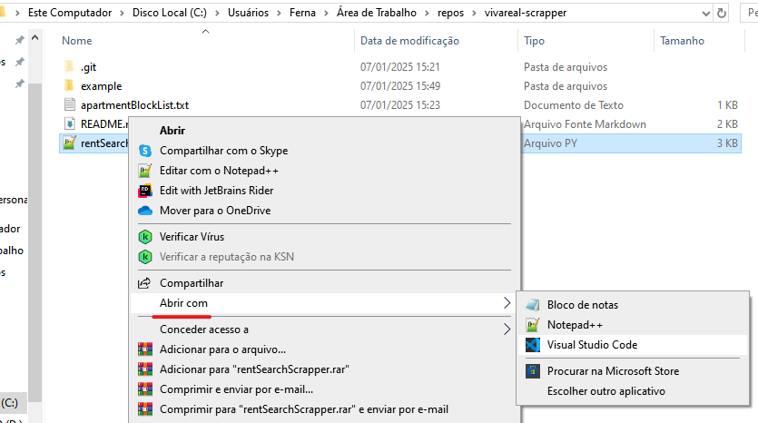
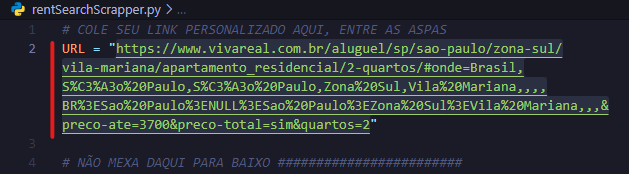

# vivareal-filter-realestate-scrapper
Este projeto tem como objetivo ajudar na procura de apartamentos dentro do website [VivaReal](https://www.vivareal.com.br).

No site, geralmente aparecem muitos resultados e não há forma de filtrar os imóveis que não nos servem. Com essa necessidade, surgiu este projeto.

## :man_teacher: Como Utilizar?
Abaixo, segue o passo-a-passo de como utilizar este projeto.

### Pré-requisitos
- Git instalado;
- Python instalado;

### 1 - Faça o clone do projeto
Isso serve para baixar os arquivos deste projeto para sua máquina.
Abra o cmd (prompt de comando) ou o bash no local em que se deseja colocar a pasta do projeto e rode o comando abaixo.



```bash
$ git clone https://github.com/FShinoda/vivareal-scrapper.git
```

### 2 - Vá no site do VivaReal 
Vá para o site e pesquise como faria normalmente a localização desejada junto com suas outras necessidades de filtro.


### 3 - Copie o link gerado
Após finalizada a inserção dos filtros, a página irá atualizar automaticamente. Com isso, um novo link na barra de pesquisa aparecerá. Copie o mesmo.



### 4 - Jogue o link na variável URL em `rentSearchScrapper.py`
Abra o arquivo `rentSearchScrapper.py` no editor de texto de sua escolha e cole o link.




### 5 - Agora rode o arquivo `rentSearchScrapper.py`
Abra o cmd (prompt de comando) ou o bash no local onde está o arquivo `rentSearchScrapper.py` e rode-o com o comando abaixo.

> O Chrome irá se abrir sozinho, mas não se preocupe! É o robôzinho do scrapper analisando a página e retirando informações.

```bash
$ python rentSearchScrapper.py
```

Dependendo da quantidade de resultados da sua pesquisa de imóveis no VivaReal, mais pode demorar para o script finalizar, mas em geral, é bem rápido!

### 6 - Gerado o Arquivo de imóveis!
Após o script finalizar, será gerado o arquivo `apartmentList.txt` na mesma pasta do script python. Este é um arquivo contendo o link de todos os imóveis disponíveis na sua busca personalizada.
Com ele, você já pode começar sua busca pelo imóvel ideal.

:speech_balloon: _"Mas e a parte de fitrar os imóveis que eu não gostei?"._ 

Segue abaixo.

### 7 - Filtrar os Imóveis Indesejados (FINAL)
Para filtrar os imóveis indesejados, é simples: adicione os links dos mesmos no arquivo `apartmentBlockList.txt`. Ele já está presente nesse projeto, e dentro dele contém um exemplo de como devem ser adicionados os links. 

Adicionado os links a serem filtrados, note que depois será preciso rodar novamente o script (passo 5) para o resultado filtrado ser escrito no arquivo `apartmentList.txt`.

<br>

:partying_face: E acabou!  Note que, apartir daqui, será um loop:

1. Olhar os imóveis em `apartmentList.txt`;
2. Colocar os indesejados em `apartmentBlockList.txt`;
3. Quando desejar um novo e filtrado `apartmentList.txt`, rodar novamente o script;

Boas buscas! Espero ter ajudado :blush:
<br>Caso precise de alguma ajuda, me mande uma mensagem por algum dos canais de contato no [meu perfil](https://github.com/FShinoda).

## :warning: Disclaimer 
Esse foi um projeto para uso pontual e pessoal, a atualização do mesmo não está garantida, portanto idem para seu funcionamento.

Caso queira fazer algum projeto em cima desse, fique à vontade, só peço que, se for possível, dê créditos pela inspiração.

## :copyright: Licença
GNU GPLv3 - GNU General Public License v3.0
